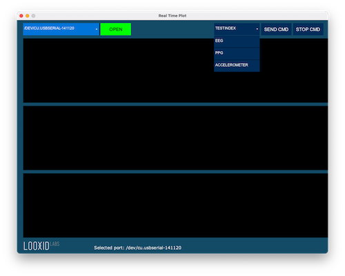

# Readl Time Plot
이 코드는 [ProtoCentral OpenView](https://github.com/Protocentral/protocentral_openview)의 코드를 포크해서 수정한 것이다. 기존 코드의 경우 지원하는 보드에 따른 시리얼 패킷의 구조가 있었고, data copy가 빈번하게 있어서 가장 일반적인 형태의 시리얼 데이터를 처리하기 위한 형태로 바꾸었다. 

## Features:

* 시리얼은 기본 230400
* 개발 환경 : [Processing 3 / 4 Java](https://processing.org/)
* 사용된 라이브러리
    * ControlP5 GUI library
    * Grafica

## 사용방법
- 먼저 연결된 시리얼 포트를 선택하여 Open 한다.
- TESTINDEX 탭을 클릭해서 EEG를 선택후 SEND CMD버튼을 누른다. 파형을 확인하고 STOP CMD를 누른다.
- TESTINDEX 탭을 클릭해서 PPG를 선택후 SEND CMD버튼을 누른다. 파형을 확인하고 STOP CMD를 누른다.
- TESTINDEX 탭을 클릭해서 ACCELEROMETER를 선택후 SEND CMD버튼을 누른다. 파형을 확인하고 STOP CMD를 누른다.
- 다른 보드를 연결하여 위와 같은 테스트를 반복한다.
- 주의 사항
    - EEG, PPG, Accelerometer의 순으로 테스트를 해야함. (테스트 펌웨어 코드가 이렇게 되어 있음)
    - 테스트할 보드의 테스트핀이 LOW로 되어 있어야 함

# License
This software is open source and licensed under the following license:
MIT License

Copyright (c) 2019 ProtoCentral

Permission is hereby granted, free of charge, to any person obtaining a copy
of this software and associated documentation files (the "Software"), to deal
in the Software without restriction, including without limitation the rights
to use, copy, modify, merge, publish, distribute, sublicense, and/or sell
copies of the Software, and to permit persons to whom the Software is
furnished to do so, subject to the following conditions:

The above copyright notice and this permission notice shall be included in all
copies or substantial portions of the Software.

THE SOFTWARE IS PROVIDED "AS IS", WITHOUT WARRANTY OF ANY KIND, EXPRESS OR
IMPLIED, INCLUDING BUT NOT LIMITED TO THE WARRANTIES OF MERCHANTABILITY,
FITNESS FOR A PARTICULAR PURPOSE AND NONINFRINGEMENT. IN NO EVENT SHALL THE
AUTHORS OR COPYRIGHT HOLDERS BE LIABLE FOR ANY CLAIM, DAMAGES OR OTHER
LIABILITY, WHETHER IN AN ACTION OF CONTRACT, TORT OR OTHERWISE, ARISING FROM,
OUT OF OR IN CONNECTION WITH THE SOFTWARE OR THE USE OR OTHER DEALINGS IN THE
SOFTWARE.
